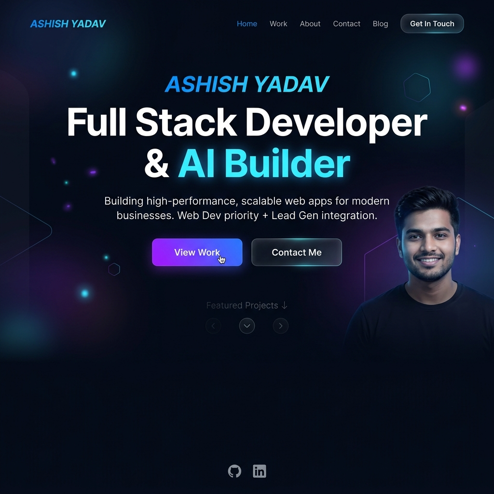

<div align="center">
  <br />
  <a href="https://github.com/ashish7802/Portfolio-website" target="_blank">
    
  </a>
  <br />

  <h1>Ashish Yadav - Modern Developer Portfolio</h1>
  
  <p>
    A premium, high-performance web portfolio built with <strong>React</strong>, <strong>Vite</strong>, and <strong>Framer Motion</strong>. Featuring a stunning glassmorphism dark mode aesthetic and smooth scrolling animations.
  </p>

  <p>
    <a href="https://ashyadavweb.netlify.app/">View Live Site</a>
    ·
    <a href="https://github.com/ashish7802/Portfolio-website/issues">Report Bug</a>
    ·
    <a href="https://github.com/ashish7802/Portfolio-website/issues">Request Feature</a>
  </p>
</div>

---

## 🌟 Features

- **Premium Dark Aesthetic**: Custom CSS variables providing a deep, elegant dark mode with glowing accents and glassmorphism cards.
- **Smooth Animations**: Powered by `framer-motion` for buttery smooth entrance and scroll animations.
- **Fully Responsive**: Flawless experience across all devices and screen sizes.
- **Modular Sections**: Easily customizable sections including Hero, About, Experience, Projects, Blog, and Contact.
- **Vercel Ready**: Optimized Vite build settings and routing config (`vercel.json`) for seamless 1-click deployment.

## 🛠️ Built With

* **[React 19](https://react.dev/)** - UI Library
* **[Vite](https://vitejs.dev/)** - Next Generation Frontend Tooling
* **[Framer Motion](https://www.framer.com/motion/)** - Animation Library
* **[React Icons](https://react-icons.github.io/react-icons/)** - Scalable Vector Icons
* **Vanilla CSS** - Custom Design System & Utility Classes

## 🚀 Getting Started

To get a local copy up and running, follow these simple steps.

### Prerequisites

Make sure you have Node.js and npm installed on your machine.
* npm
  ```sh
  npm install npm@latest -g
  ```

### Installation

1. Clone the repo
   ```sh
   git clone https://github.com/ashish7802/Portfolio-website.git
   ```
2. Navigate to the project directory
   ```sh
   cd Portfolio-website
   ```
3. Install NPM packages
   ```sh
   npm install
   ```
4. Start the development server
   ```sh
   npm run dev
   ```

## 🌐 Deployment

This project is configured out-of-the-box for **Vercel**.

1. Connect your GitHub repository to Vercel.
2. Vercel will automatically detect the **Vite** framework.
3. Keep the default build settings:
   - Build Command: `npm run build`
   - Output Directory: `dist`
4. Click **Deploy**.

*(A `vercel.json` file is already included to handle SPA routing).*

## 📬 Contact

**Ashish Yadav** - Full Stack Developer & AI Builder

- Email: [ashishyadav4818@gmail.com](mailto:ashishyadav4818@gmail.com)
- LinkedIn: [Ashish Yadav](https://www.linkedin.com/in/ashish-yadav-ab206124a)
- Phone: +91 9794918800

---
<div align="center">
  <sub>Built with ❤️ by Ashish Yadav</sub>
</div>
